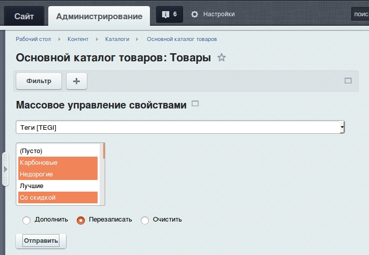
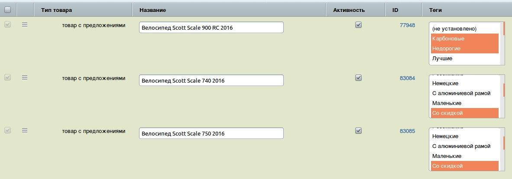

# custom-iblock-element-admin

Для чего этот модуль?
Модуль позволяет массово устанавливать необходимые свойства в форме на страницах представления элементов инфоблока.

Настройка: 
1) перенесите файл admin_header.php (позволяет костомизировать админку bitrix не затрагивая ядро) в папку php_inteface рабочего проекта и укажите верный путь до файла /loacal/custom_admin/js/sctipt.js

Модуль подтягивает jquery в админку и если он у вас уже подключен то стоит удалить его из файла admin_header.php

Если настроиле верно должны увидеть следующее 

 

 

